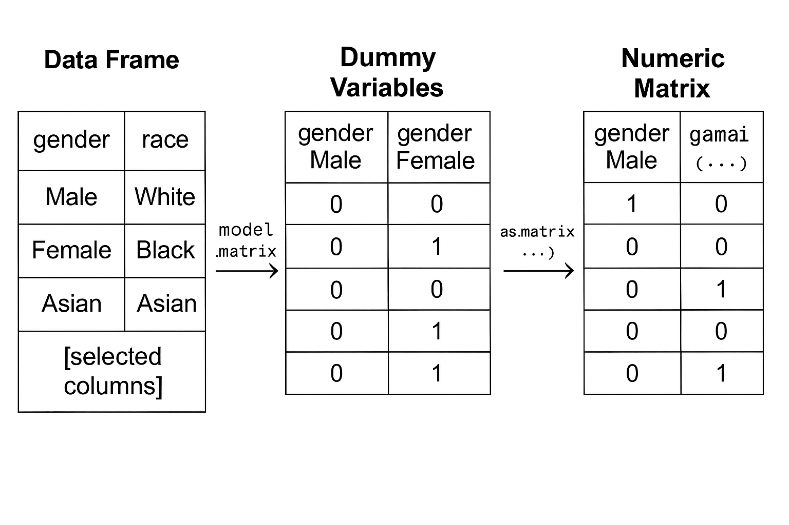
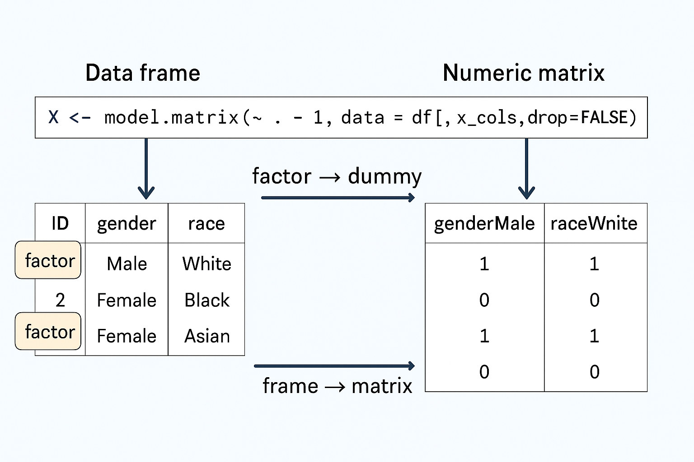

# 1. Background

When fitting a causal forest using the `grf` package, the function  
`causal_forest(X, Y, D)` expects:

- **X** – a numeric matrix of features  
- **Y** – a numeric outcome vector  
- **D** – a numeric treatment indicator (here it means treatment * post)

The backend of `grf` is written in C++.  
C++ cannot directly handle R’s flexible data structures such as data frames or factors.  
It expects clean numeric arrays (`double*` in C++).  
Therefore, before modelling, we must ensure that `X` is:

1. a **matrix**, not a data frame or tibble; and  
2. internally stored as **double-precision floating-point numbers**.

---

# 2. Why a Matrix?

In R, data frames can mix types: some columns numeric, others factors or logicals.  
Machine learning algorithms, however, require all inputs to be numeric and of the same type.  
That’s why we use:

```r
X <- model.matrix(~ . - 1, data = df)
```

This does two things:

* Converts categorical (factor) variables into numeric dummy variables;
* Removes the intercept (`-1`), leaving only the pure feature values.

At this point `X` becomes a **numeric matrix**, suitable for models that expect arrays of numbers.

---

# 3. Why a *Double* Matrix?

Even when `model.matrix()` already returns numeric values,
we still make sure the underlying storage type is `double` (8-byte floating point).
This ensures perfect compatibility with the C++ engine used in `grf`.

We do this explicitly with:

```r
X <- as.matrix(X)
storage.mode(X) <- "double"
```

The first line guarantees that `X` is a plain R matrix, not a tibble or special object.
The second line forces all numbers inside the matrix to be stored as **double precision**.
It’s a safety step to avoid hidden type conversions or memory duplication later.

---

# 4. Step-by-Step Breakdown of This Line

Let’s now carefully dissect the key line:

```r
X <- model.matrix(~ . - 1, data = df[, x_cols, drop = FALSE])
```

## Overall Goal

This line converts the selected columns of the data frame (`df[, x_cols]`)
into a **pure numeric matrix (`X`)**.
Every categorical variable (factor) is expanded into dummy variables (0/1),
and the intercept column is removed.

The resulting matrix `X` will serve as the **feature matrix**
for machine learning models like `grf::causal_forest()`.

---

## Syntax Structure (from outside in)

### Outer layer

```r
X <- ...
```

This assigns the result on the right-hand side (a numeric matrix) to the object `X`.
`X` will later be used as the feature matrix in the model.

### Middle layer

```r
model.matrix(~ . - 1, data = ...)
```

`model.matrix()` is a base R function that converts a formula and data frame
into a **design matrix**.
R uses this internally whenever you fit models like `lm()`, `glm()`, or `lmer()`.

For example:

```r
lm(y ~ x1 + x2 + gender, data = df)
```

internally constructs a design matrix equivalent to:

```r
X <- model.matrix(~ x1 + x2 + gender, data = df)
```

So the role of `model.matrix()` is:

> Convert a *formula + dataset* into a purely numeric design matrix.

---

## Formula Part: `~ . - 1`

Let’s break down the symbols:

| Symbol | Meaning                                        |
| :----- | :--------------------------------------------- |
| `~`    | starts the formula, read as “is a function of” |
| `.`    | use **all variables** from the dataset         |
| `- 1`  | remove the intercept column                    |

Thus, `~ . - 1` means:

> “Use all columns in the data, but do not include an intercept term.”

### Why remove the intercept?

If you omit `-1`, R automatically adds a column of 1s as an intercept.
For example:

```r
model.matrix(~ gender, data=df)
```

would return:

| (Intercept) | genderFemale |
| ----------- | ------------ |
| 1           | 0            |
| 1           | 1            |

Since we only want the explanatory variables themselves — not a constant intercept —
we include `-1` to remove that column.

---

## The `data = df[, x_cols, drop = FALSE]` Part

This tells `model.matrix()` which subset of the data frame to use.

### (1) `df[, x_cols]`

Selects the columns of `df` whose names are stored in `x_cols`.
Example:

```r
x_cols <- c("gender", "race", "deprivation", "severity", "comorbidity")
```

So `df[, x_cols]` gives a smaller data frame containing just those variables.

### (2) `drop = FALSE`

Ensures that if only one column is selected,
the result stays as a **data frame** rather than becoming a simple vector.
This is a defensive programming habit that prevents errors later.

Example:

```r
df[, "gender"]
# returns a vector

df[, "gender", drop = FALSE]
# returns a one-column data frame
```

Keeping the data frame structure ensures that `model.matrix()` behaves consistently.

---

## What `model.matrix()` Does (Example)

Suppose:

```r
x_cols <- c("gender", "race")
df[, x_cols]
```

| gender | race  |
| :----- | :---- |
| Male   | White |
| Female | Black |
| Female | Asian |

Now run:

```r
X <- model.matrix(~ . - 1, data = df[, x_cols, drop = FALSE])
```

You get:

| genderMale | genderFemale | raceWhite | raceBlack | raceAsian |
| :--------- | :----------- | :-------- | :-------- | :-------- |
| 1          | 0            | 1         | 0         | 0         |
| 0          | 1            | 0         | 1         | 0         |
| 0          | 1            | 0         | 0         | 1         |

Each factor variable is expanded into multiple dummy columns,
each containing only 0s and 1s.
There’s no intercept column.
The result is a clean numeric matrix.

---

## Checking the Result

You can confirm its structure with:

```r
class(X)    # "matrix"
typeof(X)   # "double"
head(X)
```

You’ll find that:

* `X` is a regular R matrix (not a data frame or tibble);
* all entries are double (numeric floating-point values);
* each row represents an observation, and each column represents a feature.

---

## ✅ In One Sentence

> `X <- model.matrix(~ . - 1, data = df[, x_cols, drop = FALSE])`
> converts the selected columns of `df` into a pure numeric matrix `X`,
> automatically expanding categorical variables into dummy variables and
> removing the intercept column — ensuring it can be directly used
> in machine learning models like `causal_forest()`.

---

# 5. Visual Explanation







# 6. Why Causal Forest Requires Doubles

The `grf::causal_forest()` function is implemented in C++.
Its core signature looks like this:

```cpp
void causal_forest(const double* X, const double* Y, const double* D, ...);
```

It literally asks for pointers to **double-precision arrays**.
If you pass an integer or logical matrix, R has to create a temporary copy and convert it.
This wastes memory and can trigger errors such as:

> “Error: X must be a numeric matrix”

To avoid this, we explicitly prepare a **double matrix** in advance.

---

# 7. Quick Comparison

| Object                          | `class()`      | `typeof()`    | Acceptable for `grf`? | Note              |
| :------------------------------ | :------------- | :------------ | :-------------------- | :---------------- |
| `data.frame`                    | `"data.frame"` | `"list"`      | ❌                     | mixed types       |
| `matrix(1:6, nrow=2)`           | `"matrix"`     | `"integer"`   | ❌                     | integer only      |
| `as.matrix(df)`                 | `"matrix"`     | `"character"` | ❌                     | contains strings  |
| `model.matrix(~ . -1, data=df)` | `"matrix"`     | `"double"`    | ✅                     | ideal input       |
| `storage.mode(X) <- "double"`   | `"matrix"`     | `"double"`    | ✅                     | guaranteed double |

---

# 8. Summary

✅ **In plain words:**

> Converting to a *double matrix* means turning all your variables into a simple table of numbers where each value is stored as an 8-byte floating-point number.
> This is exactly what the causal forest’s C++ backend expects — fast, stable, and universal.